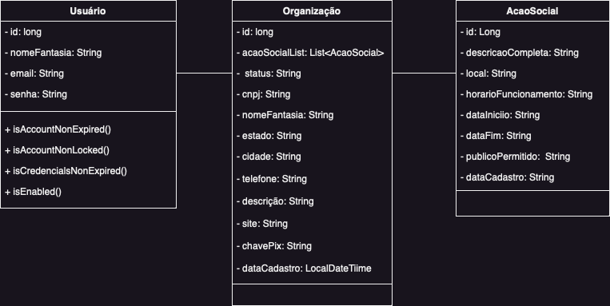

# AlimentandoVidas
 
O projeto "Alimentando Vidas" é um projeto solidário que visa combater a fome por meio da disponibilização de informações sobre organizações e ações sociais. Essa iniciativa tem como objetivo fornecer acesso fácil e rápido a uma lista de organizações que atuam no combate à fome, permitindo que as pessoas conheçam mais sobre essas organizações e suas respectivas ações sociais.

### Alguns exemplos de Ações que podem ser divulgadas:

- **Distribuição de alimentos:** Programas que fornecem alimentos básicos, como cestas básicas, para famílias em situação de vulnerabilidade.

- **Refeitórios comunitários:** Locais onde são oferecidas refeições gratuitas para pessoas que não têm acesso regular a alimentos nutritivos.

- **Hortas comunitárias:** Iniciativas que promovem o cultivo de alimentos em espaços públicos ou comunitários, permitindo que as pessoas tenham acesso a vegetais e frutas frescas.

- **Programas de capacitação:** Ações que oferecem treinamento e suporte para pessoas em situação de vulnerabilidade, ajudando-as a desenvolver habilidades culinárias, nutricionais e de gestão financeira para melhorar sua segurança alimentar.

Com a API Alimentando Vidas, é possível visualizar informações detalhadas sobre cada organização, descrição, localização, telefone de contato e site. Além disso, é possível conhecer as ações sociais realizadas por cada organização, como horário de funcionamento, local, público permitido e datas de início e término dessas ações.

Além de beneficiar as pessoas que precisam de ajuda, a API Alimentando Vidas também beneficia as próprias organizações. Por meio dessa plataforma, as organizações têm a oportunidade de divulgar suas ações sociais e formas de arrecadar dinheiro, como por meio do Pix. Com maior visibilidade, as organizações podem atrair mais doações e, assim, ampliar sua capacidade de ajudar aqueles que mais necessitam.

 
 

# API - Parte técnica 
 
A API Alimentando Vidas é uma aplicação desenvolvida em Java utilizando o framework Spring Boot. Ela oferece recursos para gerenciar organizações e ações sociais relacionadas a essas organizações.

Funcionamento Técnico
A API utiliza o padrão REST (Representational State Transfer) para a comunicação entre o cliente e o servidor. Ela é construída seguindo os princípios do estilo arquitetural REST, onde os recursos são identificados por endpoints e podem ser acessados através de operações HTTP, como GET, POST, PUT e DELETE.

### A aplicação é dividida em três controladores principais:

- OrganizacaoController: Responsável por lidar com as operações relacionadas a organizações.
- AcaoSocialController: Responsável por lidar com as operações relacionadas a ações sociais.
- UsuarioController: Responsável por lidar com as operações relacionadas a usuários e autenticação.

### Procedimento de Instalação
Para instalar e executar a API Alimentando Vidas localmente, siga os passos abaixo:

- Certifique-se de ter o Java Development Kit (JDK) e o Maven instalado em sua máquina. A versão recomendada para JDK é a JDK 11 ou superior.
- Faça o clone do repositório aqui no github.
- Navegue até o diretório clonado por meio do terminal ou prompt de comando.
- Compile o projeto executando o seguinte comando: ./mvnw clean install.
- Após a compilação, execute a API com o comando: ./mvnw spring-boot:run.

### Procedimento de Testes
Para testar os recursos JSON e endpoints da API Alimentando Vidas, utilize o swagger através do http://localhost:8080/swagger-ui/index.html#/ para enviar requisições HTTP para a API.

### Lista de endpoints

